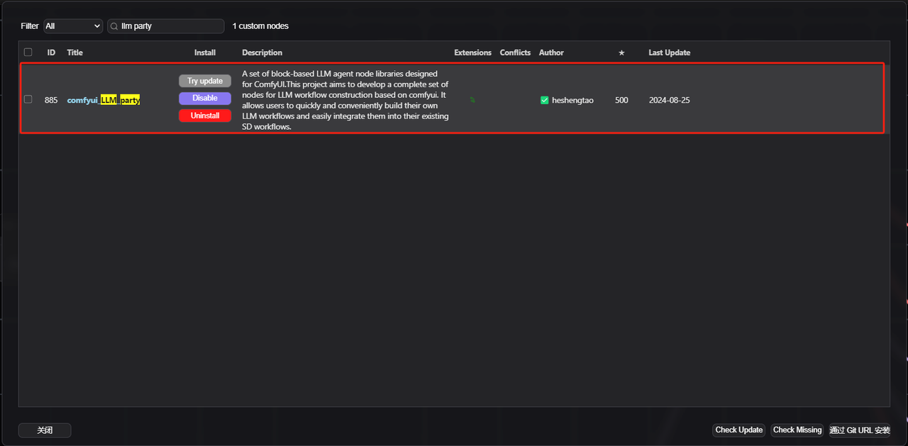
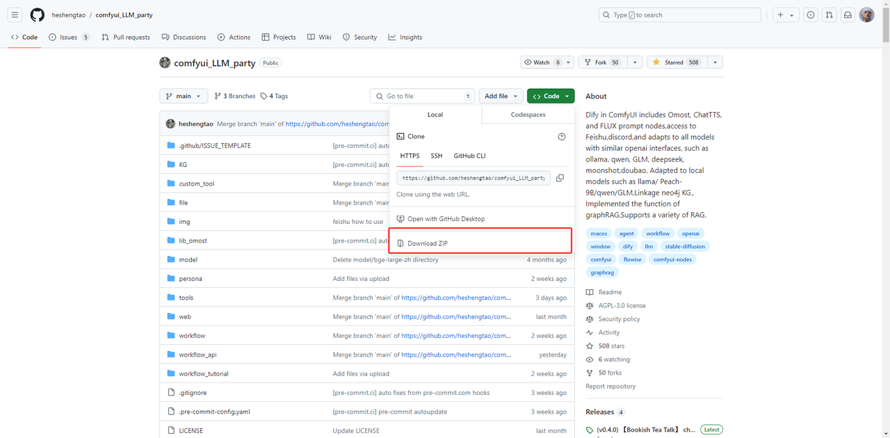
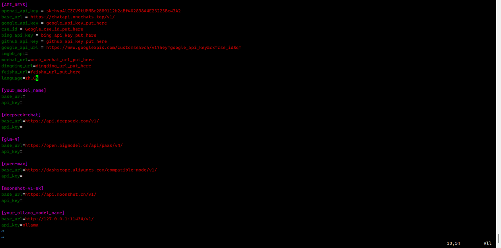
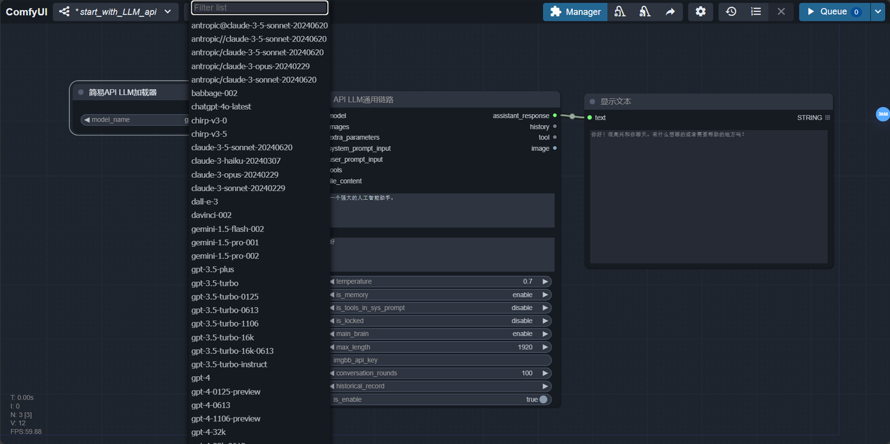
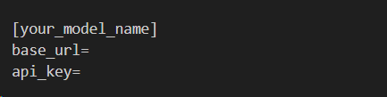
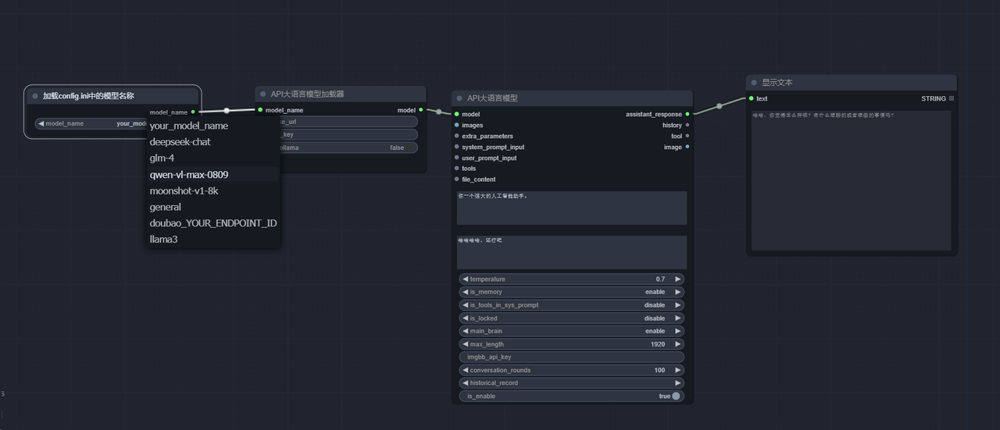
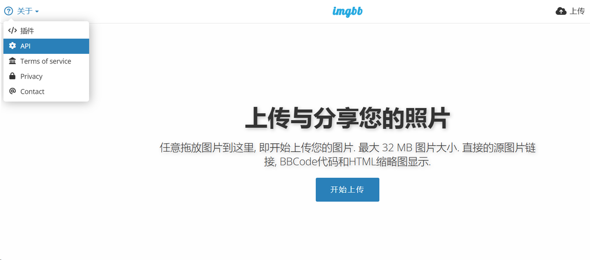

# DAY1：派对开始
## 1. 安装
使用以下方法之一安装
### 1.1 方法一：
1. 在[comfyui管理器](https://github.com/ltdrdata/ComfyUI-Manager)中搜索comfyui_LLM_party，一键安装，无需配置环境，可以跳过第2步环境部署，推荐！当然有时候管理器会抽风，安装不了依赖，你还是可以学习一下第2步的环境部署方法。

2. 重启comfyui
### 1.2 方法二：
1. 导航到 ComfyUI 根文件夹中下的custom_nodes子文件夹
2. 使用克隆此存储库。git clone https://github.com/heshengtao/comfyui_LLM_party.git
3. 需要执行第2步环境部署
### 1.3 方法三：
1. 点击右上角的CODE
2. 点击download zip
3. 需要执行第2步环境部署

4. 将下载的压缩包解压到ComfyUI 根文件夹中下的custom_nodes子文件夹中

---
## 2. 环境部署
1. 导航到comfyui_LLM_party的项目文件夹
2. 在终端输入pip install -r requirements.txt将本项目需要的第三方库部署到comfyui的环境中。请注意你是否在comfyui的虚拟环境进行安装，并关注终端中的pip报错
3. 如果你是用的comfyui Windows原版一键包，先到comfyui_LLM_party的项目文件夹，右键打开终端，你需要在终端中输入 ComfyUI_windows_portable文件夹的绝对路径\python_embeded\python.exe -m pip install -r requirements.txt进行安装。ComfyUI_windows_portable文件夹的绝对路径就是你一键包解压后的总文件夹的绝对路径。
4. 如果你是用的铁锅炖启动器，先到comfyui_LLM_party的项目文件夹，右键打开终端，你需要在终端中输入 Blender_ComfyUI_Mini文件夹的绝对路径\python_embeded\python.exe -m pip install -r requirements.txt进行安装。在铁锅炖启动器中，python_embeded文件夹一般与你的ComfyUI文件夹同级。
5. 如果你是用的秋叶启动器，先到comfyui_LLM_party的项目文件夹，右键打开终端，你需要在终端中输入 ComfyUI-aki文件夹的绝对路径\python\python.exe -m pip install -r requirements.txt进行安装。 ComfyUI-aki文件夹的绝对路径就是有启动器exe文件的那个文件夹的绝对路径。
6. 如果你出现了一些环境配置问题，可以尝试使用requirements_fixed.txt中的依赖。

---
## 3. 配置
- 可以在config.ini中配置语言，目前只有中文（zh_CN）和英文（en_US）两种，默认为你的系统语言。

- 可以使用以下方法之一配置APIKEY
### 3.1 方法一：
1. 打开comfyui_LLM_party的项目文件夹下的config.ini文件。
2. 在config.ini输入你的openai_api_key、base_url。可以填入中转API，只要是openai格式即可。填入后，你可以使用简易API LLM 加载器节点，自动获取这个base_url内的所有模型名称列表，你只需要选择即可。

3. 如果你使用ollama模型，在base_url填入http://127.0.0.1:11434/v1/，在openai_api_key填入ollama，在model_name填入你的模型名称，例如:llama3。豆包模型为你的豆包接入点ID。
4. 如果你要使用谷歌搜索或者必应搜索工具，在config.ini输入你的google_api_key、cse_id或bing_api_key。
5. 如果你要使用图片输入LLM，推荐使用图床[imgbb](https://imgbb.io)，在config.ini输入你的imgbb_api。
6. 每个模型都可以在config.ini文件中单独配置，可以参考config.ini.example文件填写。当你配置好之后，只需要在节点上输入model_name即可。参考这样的写法，[]中写你想要调用的模型名称，例如：gpt-4o-mini，并在[]下按下图中的写法填入你的base url和api key。之后你可以直接在LLM API加载器节点上，只输入模型名称，base url和api key保持为空，即可自动调用config.ini中的预设base url和api key。

7. 如果你在config.ini文件中单独配置很多模型，需要从config.ini文件中获取模型列表可以使用下面这个节点。

### 3.2 方法二：
1. 打开comfyui界面。
2. 新建LLM API 加载器节点，在节点中直接输入你的model_name（填入模型名称，例如:llama3。豆包模型为你的豆包接入点ID）、openai_api_key、base_url。
3. 如果你使用ollama模型，请使用LLM_api节点，在节点的base_url填入http://127.0.0.1:11434/v1/，在api_key填入ollama，在model_name填入你的模型名称，例如:llama3。或者直接打开LLM API加载器节点上的is_ollama再填入model_name即可
4. 如果你要使用图片输入LLM，推荐使用图床imgbb，在节点上输入你的imgbb_api_key。下图为查看imgbb_api_key的位置。

## 4. 今日成就
恭喜你达成成就：【欢迎加入派对~我的朋友！】