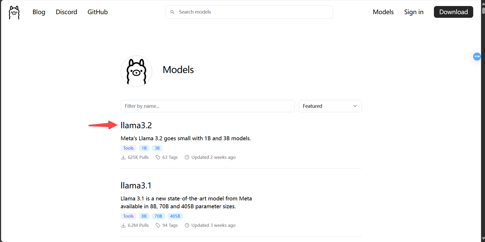

# DAY2：LLM API怎么玩

## 1. LLM API支持
1. 支持所有openai格式的API调用(结合[oneapi](https://github.com/songquanpeng/one-api)可以调用几乎所有LLM API，也支持所有的中转API)，base_url的选择参考[config.ini.example](config.ini.example)，目前已测试的有：
* [openai](https://platform.openai.com/docs/api-reference/chat/create)（完美适配所有的openai模型，包括4o和o1系列！）
* [ollama](https://github.com/ollama/ollama)（推荐！如果你是本地调用，非常推荐使用ollama方式托管你的本地模型！）
* [Azure OpenAI](https://azure.microsoft.com/zh-cn/products/ai-services/openai-service/)
* [llama.cpp](https://github.com/ggerganov/llama.cpp?tab=readme-ov-file#web-server)（推荐！如果你想使用本地gguf格式的模型，可以使用llama.cpp项目的API接入本项目！）
* [Grok](https://x.ai/api)
* [通义千问/qwen](https://help.aliyun.com/zh/dashscope/developer-reference/compatibility-of-openai-with-dashscope/?spm=a2c4g.11186623.0.0.7b576019xkArPq)
* [智谱清言/glm](https://open.bigmodel.cn/dev/api#http_auth)
* [deepseek](https://platform.deepseek.com/api-docs/zh-cn/)
* [kimi/moonshot](https://platform.moonshot.cn/docs/api/chat#%E5%9F%BA%E6%9C%AC%E4%BF%A1%E6%81%AF)
* [豆包](https://www.volcengine.com/docs/82379/1263482)
* [讯飞星火/spark](https://xinghuo.xfyun.cn/sparkapi?scr=price)
* [Gemini](https://developers.googleblog.com/zh-hans/gemini-is-now-accessible-from-the-openai-library/)(原本的Gemini API LLM 加载器节点在新版本的已被弃用，请使用LLM API加载器节点，base_url选择为：https://generativelanguage.googleapis.com/v1beta/)

2. 支持[aisuite](https://github.com/andrewyng/aisuite)兼容的所有API调用：
* [anthropic/claude](https://www.anthropic.com/)
* [aws](https://docs.aws.amazon.com/solutions/latest/generative-ai-application-builder-on-aws/api-reference.html)
* [vertex](https://cloud.google.com/vertex-ai/docs/reference/rest)
* [huggingface](https://huggingface.co/)

你可以在这些链接里选择一个你喜欢的API，开始今天的搭建！如果你还不会注册API，可以去查看这些大模型官网的API文档，一步步就能申请到你的API key!
## 2. 从最基础的三个节点开始！
1. 从任意的类openai接口接入party
从这里下载工作流文件:[start_with_LLM_api](https://github.com/heshengtao/comfyui_LLM_party/blob/main/workflow/start_with_LLM_api.json) ；又或者从你本地的comfyui_LLM_party\workflow的路径下start_with_LLM_api.json文件拖入comfyui
将这个文件拖入comfyui中，然后你就可以看到以下画面：

如果你已经在comfyui_LLM_party\config.ini文件中配置好了openai_api_key、base_url。那么你只需要修改API LLM 加载器节点上的model name为你想要调用的模型名称，例如：gpt-4o-mini，然后点击queue即可！无需再次填写API LLM 加载器节点上的api_key、base_url。
如果你没有在配置文件中配置，你需要在API LLM 加载器节点上填写api_key、base_url，然后点击queue即可！
2. 从ollama接入party
首先你需要下载ollama，查看model界面,点击你想要的模型。

点击复制ollama run <model name>的命令，到CMD中运行。

从这里下载工作流文件:start_with_Ollama；又或者从你本地的comfyui_LLM_party\workflow的路径下ollama.json文件拖入comfyui
将这个文件拖入comfyui中，然后你就可以看到以下画面：

注意！请启动你本地的ollama，你可以在终端内输入ollama list来查看本地ollama能调用的模型名称，你需要修改API LLM 加载器节点上的model name为你想要调用的模型名称，例如：qwen2。
此外，你可以打开API LLM 加载器节点上的is ollama属性，此时，你可以不必填写api_key、base_url，节点会自动帮你填入ollama的api_key、base_url。
常见报错的解决方案：
如果你无法连接，尝试将base_url修改为http://127.0.0.1:11434/v1/，如果还是不能连接，请尝试关闭你的VPN。
3. 发挥你的想象力，还有很多很多模型托管软件有自己的openai格式的API，都可以连入party，例如：vllm、xinference等等
## 3. 简易API LLM加载器
如果你已经在comfyui_LLM_party\config.ini文件中配置好了openai_api_key、base_url。还有一种更简单的方法来加载API LLM模型，就是将API LLM加载器节点替换为简易API LLM加载器。如下图所示：

你可以直接选择你配置文件中所给的API接口中所有的模型。ollama也是同样的：将在comfyui_LLM_party\config.ini文件中配置好了openai_api_key、base_url改成这样即可！

## 4. API LLM通用链路节点详解
以下是API LLM通用链路节点详解，你可以不用一下看懂，你需要知道查询这些参数的时候再来看也可以。

1. 可以直接在节点上输入系统提示词、用户提示词，也可以使用system prompt input和user prompt input来输入，可接受字符串类型的输入。system prompt input一般用来挂载面具节点。本质上和下面的两个输入框没有区别。
2. 大模型节点还可以从tools接口接受工具节点的输出，可以从file_content接口接受字符串形式的输入，这些输入会被当作模型的知识库，以词向量相似度来搜索相关的内容输入到模型中。
3. 大模型节点的is_memory可以决定大模型是否拥有记忆，可以将is_memory改为disable，再运行，这时模型会清楚之前的对话记录，再切换回enable，之后的运行中模型就会保留与你的对话记录。
4. 可以通过assistant_response来查看本轮对话中模型的回复，也可以通过history来查看多轮对话的历史记录。
5. 即使外部参数不变，大模型节点总是会运行，因为大模型对同一个问题也总是有着不同的回答。
6. Input：
  - is_tools_in_sys_prompt：决定了tools的信息是否会输入到系统提示词中。如果输入到系统提示词中，可以让部分没有工具能力的模型解锁工具能力。
  - Is_memory :开启后，LLM获得记忆，如果不开启，就每次都会清除记忆，重新开始。 
  - is_locked：当你没有更改任何参数时，直接返回上轮对话的结果，节省算力，稳定LLM的输出结果。
  - main_brain：决定了大模型是不是与用户对接的模型，禁用后，LLM节点可以作为另一个LLM节点的一个工具。
  - conversation_rounds：决定了LLM的对话轮次，当超出对话轮次后，会只读取最近的对话轮次。
  - historical_record：可以将之前的对话记录加载到LLM中，继续上次的聊天。
  - tools：输入为LLM的工具调用接口，tool输出则是将该LLM节点当做工具使用的接口，一般不使用。
  1. Imgbb api key 是可选的，如果你使用视觉功能时，不填这个key，就是base64编码传输到openai，如果加了一个key，就是图床生成URL后，将URL传入openai，不填也不影响使用，只是会影响对话记录的可读性。
7. Output：
  - assistant_response：为LLM的文字输出
  - history：为LLM的对话记录
  - Tool :当LLM作为另一个LLM的工具时，启用这个输出。大部分情况下可以无视。
  - Image: 在接一些能生图的工具节点时，可以输出图片。
## 5. 今日成就
恭喜你达成成就：【API调用都被你整明白了，你已经学会做AI套壳应用的精髓了】