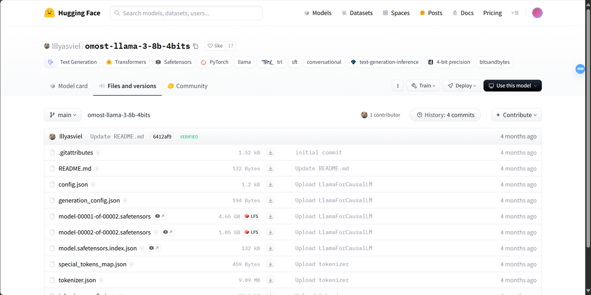
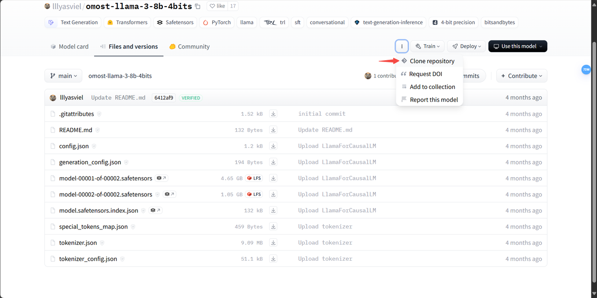
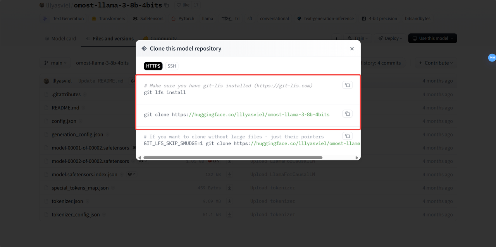
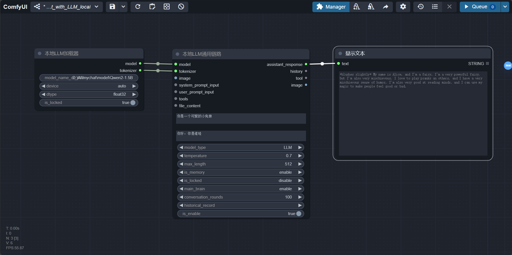
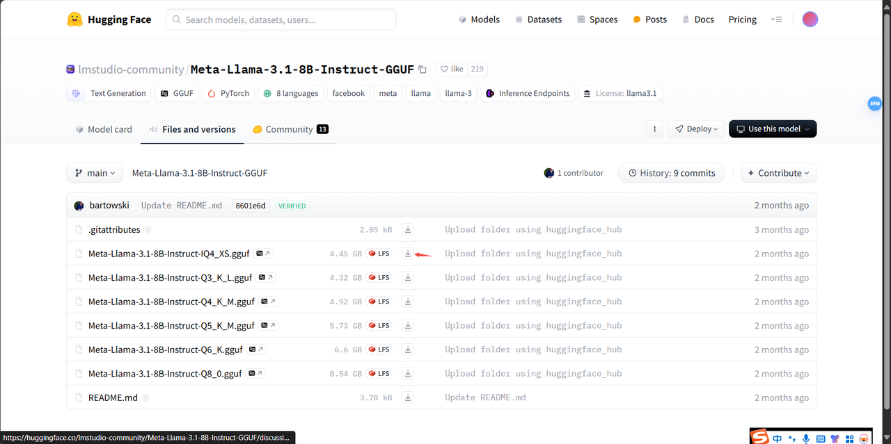
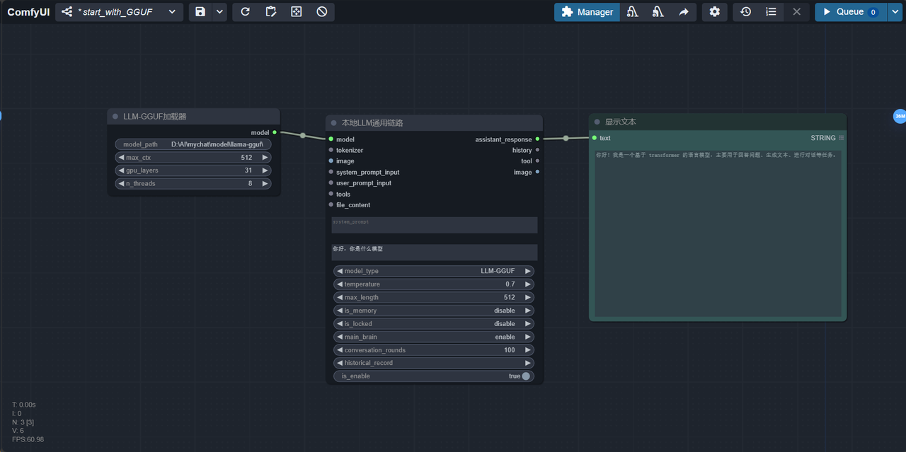
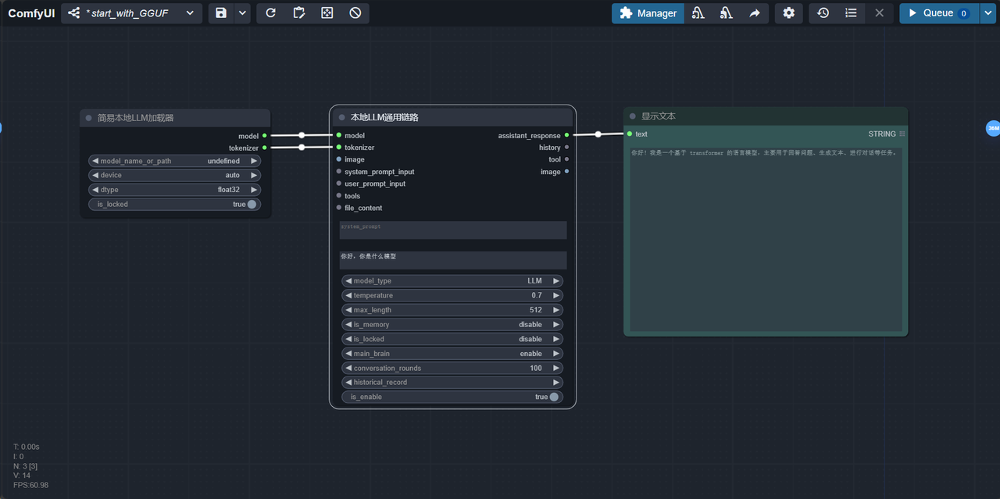
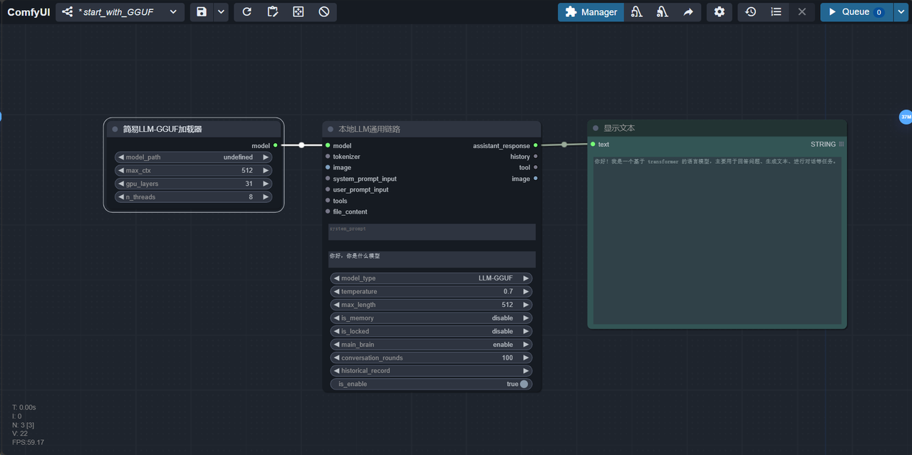
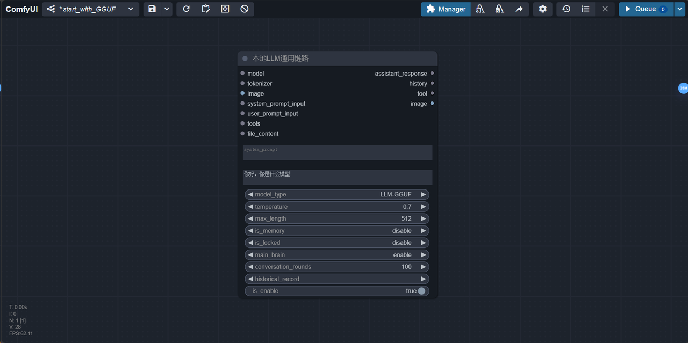

# DAY3：本地LLM怎么玩
## 1. LLM 本地支持
兼容transformer库的大部分本地模型（本地LLM模型链节点上的model type已改成LLM、VLM-GGUF、LLM-GGUF三个选项，对应了直接加载LLM模型、加载VLM模型和加载GGUF格式的LLM模型），如果你的VLM或GGUF格式的LLM模型报错了，请在[llama-cpp-python](https://github.com/abetlen/llama-cpp-python/releases)下载最新版本的llama-cpp-python，目前已测试的有：
* [ClosedCharacter/Peach-9B-8k-Roleplay](https://huggingface.co/ClosedCharacter/Peach-9B-8k-Roleplay)(推荐！角色扮演模型)
* [lllyasviel/omost-llama-3-8b-4bits](https://huggingface.co/lllyasviel/omost-llama-3-8b-4bits)(推荐！丰富提示词模型)
* [meta-llama/Llama-2-7b-chat-hf](https://huggingface.co/meta-llama/Llama-2-7b-chat-hf)
* [Qwen/Qwen2-7B-Instruct](https://huggingface.co/Qwen/Qwen2-7B-Instruct)
* [xtuner/llava-llama-3-8b-v1_1-gguf](https://huggingface.co/xtuner/llava-llama-3-8b-v1_1-gguf)
* [lmstudio-community/Meta-Llama-3.1-8B-Instruct-GGUF](https://huggingface.co/lmstudio-community/Meta-Llama-3.1-8B-Instruct-GGUF/tree/main)
* [meta-llama/Llama-3.2-11B-Vision-Instruct](https://huggingface.co/meta-llama/Llama-3.2-11B-Vision-Instruct)
一般来说，我们都是从huggingface这个网站上下载模型，如果你是国内网络环境，请在魔塔社区下载，也是一样的。
## 2. 学会调用分散格式的本地LLM
1. 第一步就是下载本地模型，你可以选择从hugging face上下载
也可以从我的百度网盘中下载一些我已经测试过的模型：百度云地址，提取码：qyhu
当你在hugging face上找到了一个这样的模型：

可以看到这个模型这个模型里的文件非常多，且没有视觉能力，这就是典型的分散格式的本地LLM。你需要把这个仓库里的所有文件都下载到本地。点击图中的这里：

然后在你存放模型的文件夹下使用以下命令行：（如果方便的话，建议放在comfyui_LLM_party\model\LLM路径下，之后可以被简易加载器自动加载）

2. 从这里下载工作流文件:[start_with_LLM_local](https://github.com/heshengtao/comfyui_LLM_party/blob/main/workflow/start_with_LLM_local.json) ；又或者从你本地的comfyui_LLM_party\workflow的路径下start_with_LLM_local.json文件拖入comfyui
将这个文件拖入comfyui中，然后你就可以看到以下画面：

3. 在本地LLM加载器节点上的model name or path属性上填入你的模型文件夹的绝对路径，例如：E:\model\Llama-3.2-1B-Instruct。又或者你可以填入一个hugging face的repo id，这会从hugging face上直接拉取对应的模型到本地，例如：lllyasviel/omost-llama-3-8b-4bits。点击queue即可！
## 3. 学会调用GGUF格式的本地LLM
1. 同样可以从我的网盘里找到一些我测试过的模型：[百度云地址](https://pan.baidu.com/share/init?surl=T4aEB4HumdJ7iVbvsv1vzA&pwd=qyhu)，提取码：qyhu
当你在hugging face上找到了一个这样的模型：

这种就是典型的GGUF格式的模型，仓库里有很多GGUF格式，但我们只需要下载其中一个。你可以根据你的本地显存来选择模型，一般来说，越大的模型，效果越好。点击这个下载的图标，就可以把单个文件下载到你的本地了，推荐你将这个GGUF文件放到comfyui_LLM_party\model\LLM-GGUF路径下，之后可以被简易加载器自动加载。
2. 从这里下载工作流文件:[start_with_LLM_GGUF](https://github.com/heshengtao/comfyui_LLM_party/blob/main/workflow/start_with_GGUF.json) ；又或者从你本地的comfyui_LLM_party\workflow的路径下start_with_GGUF.json文件拖入comfyui
将这个文件拖入comfyui中，然后你就可以看到以下画面：

3. 在LLM GGUF加载器的model path属性上输入你的GGUF文件的绝对路径，例如：D:\AI\model\llama-gguf\Meta-Llama-3.1-8B-Instruct-IQ4_XS.gguf。然后点击queue即可！
## 4. 简易本地LLM加载器
你可以将本地LLM加载器节点、LLM GGUF加载器节点替换成它们的简易加载版本，简易加载器会从comfyui_LLM_party\model中自动获取你的模型，你只需要选择即可。如下图所示

## 5. 本地LLM通用链路节点详解
以下是本地LLM通用链路节点详解，你可以不用一下看懂，你需要知道查询这些参数的时候再来看也可以。

1. 兼容transformer库的大部分本地模型（本地LLM模型链节点上的model type已改成LLM、VLM-GGUF、LLM-GGUF三个选项（其实有第4个选项VLM-testing，但还在测试中，目前只支持Llama-3.2），对应了直接加载LLM模型、加载VLM模型和加载GGUF格式的LLM模型），如果你的GGUF格式的LLM或VLM模型报错了，请在llama-cpp-python下载最新版本的llama-cpp-python。
2. model_name_or_path填入模型的项目文件夹即可，适配所有可以被transformer兼容的型号。也可以填写hugging face上的repo id，直接拉取模型。
3. 其余参数与API LLM通用链路节点一致。详见DAY2文档。
## 6. 今日成就
恭喜你达成成就：【LLM到了我的显存上，用来干点什么可就由不得你了】