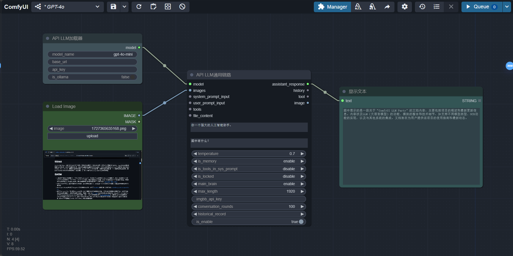
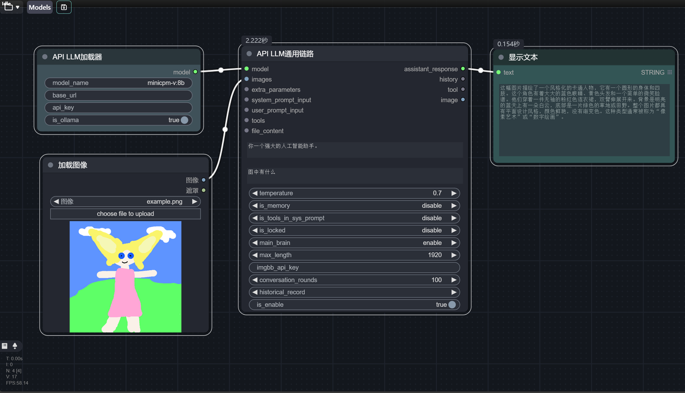
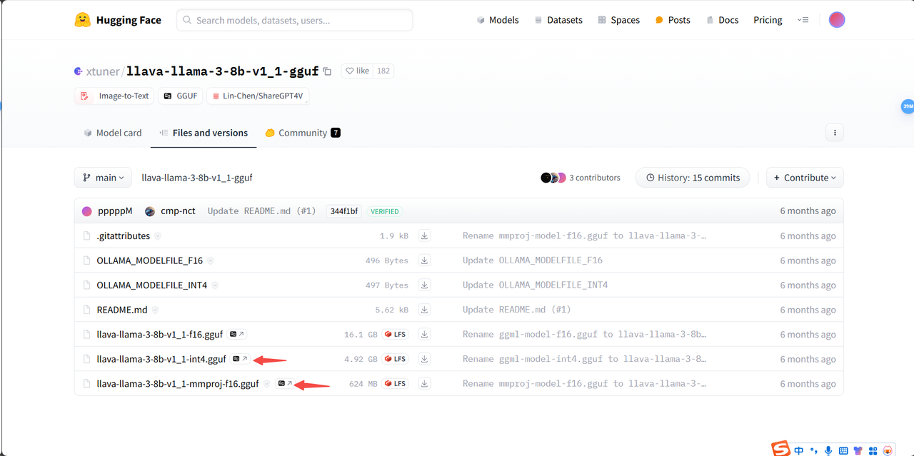
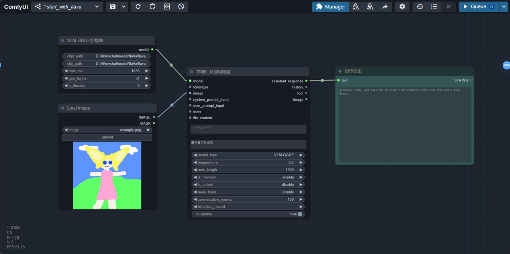
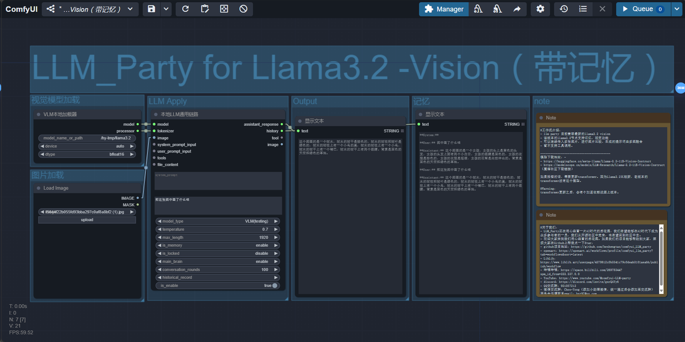

# DAY4：【眼看喜】让你的LLM拥有眼睛
## 1. 玩上视觉模型的4种方法
在comfyui LLM party中，有4种使用视觉大模型（VLM）的方法：
- 使用带视觉的大模型API，例如：[gpt-4o-mini](https://platform.openai.com/docs/api-reference/chat/create)
- 使用ollama里的封装好了的VLM大模型，例如：[minicpm-v](https://ollama.com/library/minicpm-v)
- 使用VLM-GGUF节点调用GGUF格式的VLM模型，例如：[xtuner/llava-llama-3-8b-v1_1-gguf](https://huggingface.co/xtuner/llava-llama-3-8b-v1_1-gguf)
- 使用VLM节点调用分散格式的VLM模型，目前只支持：[meta-llama/Llama-3.2-11B-Vision-Instruct](https://huggingface.co/meta-llama/Llama-3.2-11B-Vision-Instruct)
那么我们今天就从易到难，讲讲这些视觉大模型的调用方法吧！
## 2. 使用gpt-4o-mini来查看图片
这个是最简单的方法，你只需把这个工作流拖进comfyui，然后填入你的API key和base URL就行：[GPT-4o](https://github.com/heshengtao/comfyui_LLM_party/blob/main/workflow/GPT-4o.json)

## 3. 使用ollama中的VLM查看图片
1. 首先你需要下载[ollama](https://ollama.com/)
2. 查看[minicpm-v](https://ollama.com/library/minicpm-v),将命令行复制到CMD中，下载模型到本地。参考DAY2中的内容。
3. 然后你只需把这个工作流拖进comfyui：[minicpm-v-ollama](https://github.com/heshengtao/comfyui_LLM_party/blob/main/workflow/minicpm-v-ollama.json)，然后就能看到如下画面。

## 4. 使用GGUF格式的VLM模型查看图片
1. 下面，我们以[xtuner/llava-llama-3-8b-v1_1-gguf](https://huggingface.co/xtuner/llava-llama-3-8b-v1_1-gguf)为例，你可以点击链接下载如下两个GGUF模型：

2. 将箭头所指的模型放到任意位置，但推荐放到comfyui_LLM_party\model\VLM-GGUF路径下，这样可以被简易加载器直接搜索到。
3. 将这个工作流拖入comfyui：[VLM-GGUF](https://github.com/heshengtao/comfyui_LLM_party/blob/main/workflow/start_with_llava.json)，然后你会看到如下画面：

4. 将你下载好的两个模型文件：
llava-llama-3-8b-v1_1-int4.gguf  放到ckpt_path中，
llava-llama-3-8b-v1_1-mmproj-f16.gguf 放到clip_path中.
5. 点击Queue即可运行！
## 5. 使用分散格式的VLM模型查看图片
1. 目前party还只支持了[meta-llama/Llama-3.2-11B-Vision-Instruct](https://huggingface.co/meta-llama/Llama-3.2-11B-Vision-Instruct) 这个分散格式的VLM模型。你可以在huggingface或魔塔社区下载。可以放到任意位置，但推荐放comfyui_LLM_party\model\VLM路径下，这样可以被简易加载器直接搜索到。
2. 将这个工作流拖入comfyui： [start_with_VLM_local](https://github.com/heshengtao/comfyui_LLM_party/blob/main/workflow_tutorial/LLM_Party%20for%20Llama3.2%20-Vision%EF%BC%88%E5%B8%A6%E8%AE%B0%E5%BF%86%EF%BC%89.json) 

3. 将你的模型文件夹的绝对路径复制到VLM本地加载器节点的model_path属性中。
4. 点击Queue即可运行！
## 6. 今日成就
恭喜你达成成就：【获得大模型根器：眼看喜】