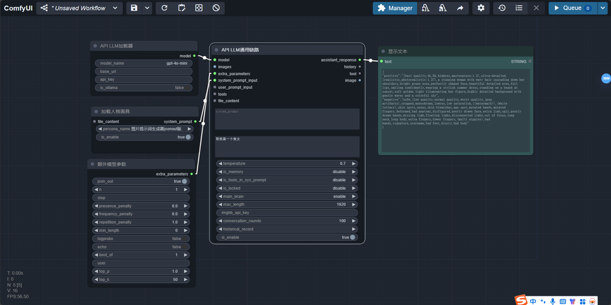

# DAY5：【意见欲】让你的LLM获得人格
## 1. 戴上人格面具
1. 系统提示词极大的影响了LLM的工作逻辑，你可以在系统提示词中填写你想要的设定，就能让LLM更加稳定的执行你的任务。但是一个复杂的任务，总是需要大量的提示词来引导的，我们不可能每次都去输入大量的系统提示词。因此，party将这些系统提示词封装成人格面具节点，方便大家随时调用。
人格面具（persona）来自于荣格心理学。LLM虽然出厂设置都是一样的，拥有相同的集体潜意识，但我们可以给他们戴上不同的面具，来获得不同的人格。
以下图为例，你可以连接一个生成SD提示词生成的工作流：


2. 你可以从一个party的基础三件套开始，然后选择[面具]--[加载面具节点]。将加载面具节点的输出连在system_prompt_input输入上。选择图片提示词生成器json out版。这时，你就得到了一个包含正向图片提示词和反向图片提示词的json字符串。如果LLM不能稳定输出干净正确的json字符串，可以选择[模型加载器]--[模型额外参数]，将其连在extra_parameters属性上，并且打开模型额外参数节点上的json out属性。如下图所示：



## 2. 让戴着面具的LLM与图像流融合
那么如何将这个json字符串的不同部分分离出来呢？
你可以使用[转换器]--[json取值节点]，将这个字典中的positive和negative这两个键所对应的值取出来，就像下面这样：


最后再连上SD的正反向提示词输入就大功告成了！这里有一个小技巧要告诉一些没有接触过comfyui的朋友们。就是clip text decode节点可以右键点击后，从菜单中将小组件转换为输入的，所有的节点都可以这样操作。


将正反向提示词输入之后，就可以生成图片了。这样你就做到了LLM+图像流的最基本的用法。一句话生成一张图片。我只是向LLM请求画一个美女，于是这个工作流就返回了一个对应的图片。
## 3. 写好一个自己的面具
这里抛砖引玉，我只给出我平时写系统提示词的一点小技巧，而且GitHub上搜索提示词，也可以搜索到很多很多好用的系统提示词，都可以保存到comfyui_LLM_party\persona路径下
我的个人经验如下：
1. 描述智能体的基本人设，例如：
```markdown
# Stable Diffusion prompt 助理

你来充当一位有艺术气息的Stable Diffusion prompt 助理。
```
2. 描述任务，例如：
```markdown
## 任务

我用自然语言告诉你要生成的prompt的主题，你的任务是根据这个主题想象一幅完整的画面，然后转化成一份详细的、高质量的prompt，让Stable Diffusion可以生成高质量的图像。
```
3. 背景介绍，例如：
```markdown
## 背景介绍

Stable Diffusion是一款利用深度学习的文生图模型，支持通过使用 prompt 来产生新的图像，描述要包含或省略的元素。

## prompt 概念

- 完整的prompt包含“**Positive Prompt:**”和"**Negative Prompt:**"两部分。
- Positive prompt 用来描述图像，由普通常见的单词构成，使用英文半角","做为分隔符。
- negative prompt用来描述你不想在生成的图像中出现的内容。
- 以","分隔的每个单词或词组称为 tag。所以prompt和negative prompt是由系列由","分隔的tag组成的。

## () 和 [] 语法

调整关键字强度的等效方法是使用 () 和 []。 (keyword) 将tag的强度增加 1.1 倍，与 (keyword:1.1) 相同，最多可加三层。 [keyword] 将强度降低 0.9 倍，与 (keyword:0.9) 相同。
```
4. 格式要求，例如：
```markdown
## Prompt 格式要求

你需要用以下json格式输出：
{
"positive":"",
"negative":""
}
```
5. 举一个例子来描述你想要的输出，对于一些比较垃圾的模型，这一步可以忽略
6. 限制，告诉模型什么不能做：
```markdown
### 3. 限制：
- tag 内容用英语单词或短语来描述，并不局限于我给你的单词。注意只能包含关键词或词组。
- 注意不要输出句子，不要有任何解释。
- tag数量限制40个以内，单词数量限制在60个以内。
- tag不要带引号("")。
- 使用英文半角","做分隔符。
- tag 按重要性从高到低的顺序排列。
- 我给你的主题可能是用中文描述，你给出的Positive prompt和negative prompt只用英文。
```
7. 告诉模型接下来就开始，例如：
```markdown
接下来，请根据我的输入，丰富成SD提示词，开始！
```
## 4. 保存自己的面具


有时候你会使用LLM通用链路节点上的system prompt来测试不同的系统提示词，那么如何将这个提示词保存到面具路径中，方便下次使用呢？
你可以先选择文本——输入字符串节点，将提示词复制进去，然后再选择面具——保存面具节点，将这个提示词保存为面具文件。重启comfyui之后，你就可以看到新的面具文件了


## 5. 今日成就
恭喜你达成成就：【获得大模型根器：意见欲】