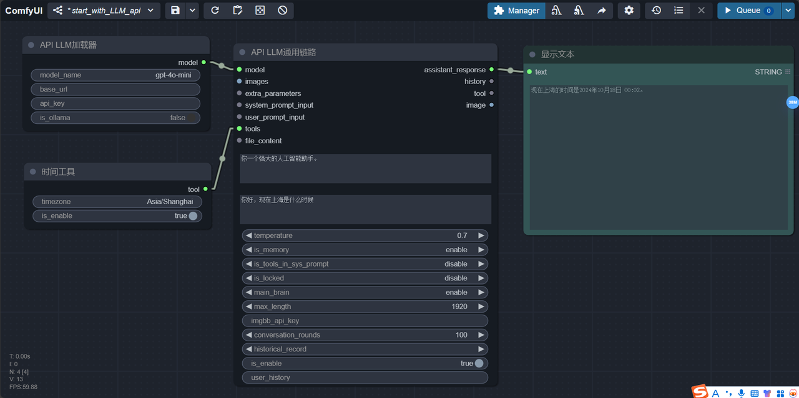
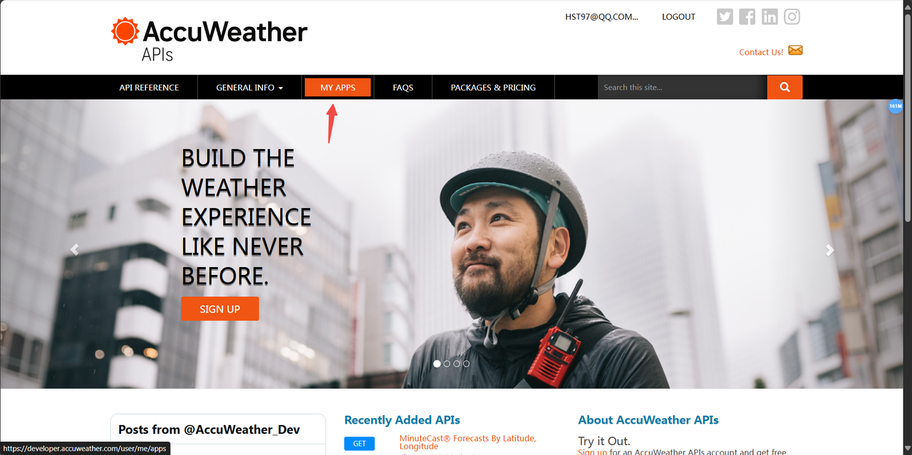
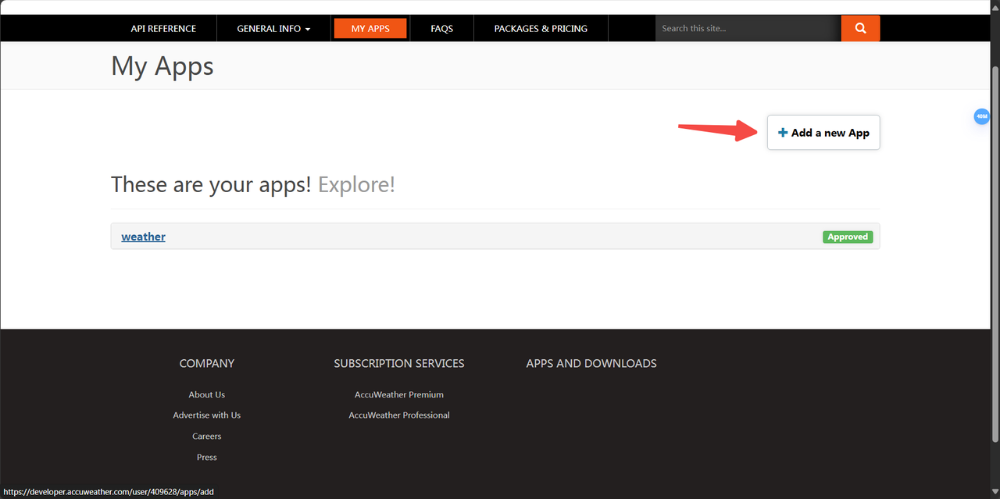
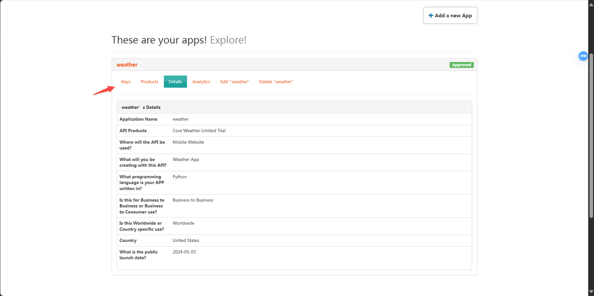
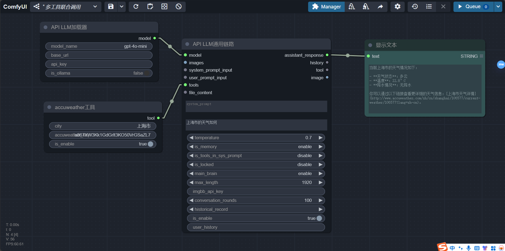
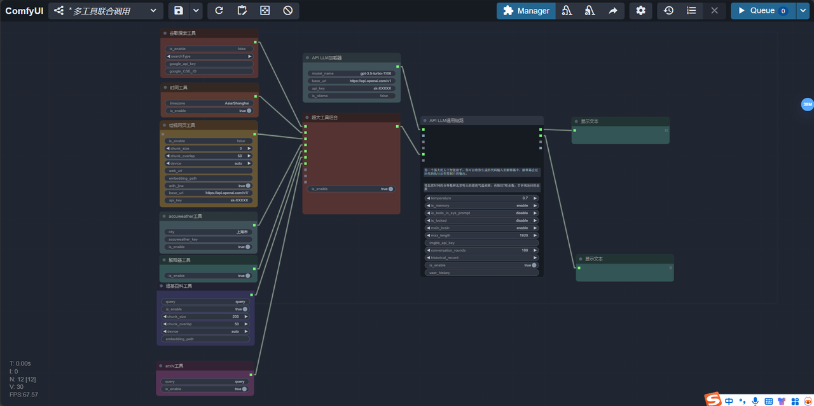

# DAY6：【鼻嗅爱】让你的LLM使用工具
1. 让LLM获取当前时间
这个其实很重要，因为让LLM知道现在是什么时候，才是一个智能助手的基础。

只需要像这样，将工具——时间工具节点连上LLM通用链路的tool输入即可。所有的工具节点都是这么使用的。
然后我们问了LLM现在上海的时间，LLM调用了时间工具后，正确回答了这个问题。
2. 让LLM获取实时天气
你需要在[accuweather](https://developer.accuweather.com/)上注册一个账号，然后创建一个API key填入accuweather天气工具节点。

点击MY APP，然后点击add a new app

这样填写你的APP信息，然后创建

再点击key，就可以拿到免费的key了
接下来填入accuweather天气工具节点，并向LLM提问。

这样你的LLM就可以查看实时天气啦！
3. 如何连上更多的工具
其实只要找到组合——工具组合节点或者超大工具组合节点即可。然后将多个工具组合在一起连入LLM。就像下面这样：

还是不推荐添加太多的工具，这会让LLM判断用哪个工具来解决问题变得困难。
4. 为什么我的模型不能调用工具
1. 很多小模型没有针对工具调用进行特殊的微调，所以并不能调用工具。如果你在使用ollama上没有tool标签的模型，又想要临时获得tool能力，你可以开启API LLM通用链路节点上的is tool in sys prompt属性。
2. 如果你是在使用分散格式LLM，默认都开启了工具写入系统提示词的代码，使这些LLM获得工具能力。如果你是在使用GGUF格式的LLM，需要这个GGUF自身具有工具能力，而且由于很多GGUF的工具调用方式不统一，不一定能完美适配。
5. 今日成就
恭喜你达成成就：【获得大模型根器：鼻嗅爱】